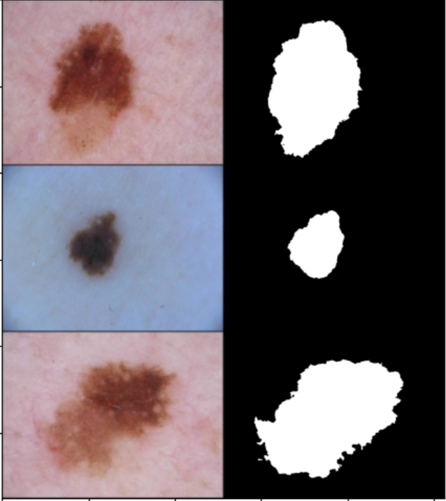

# U-net and DoubleU-net implementation
implementation of U-net and DoubleU-net for lesion boundary Segmentation ( ISIC 2018-task 1)

## TODO

- [x] Build model U-net.

- [x] Build model DoubleU-net.

- [x] Write code for Dice loss.

- [x] Write code for Jaccard-index (mean Intersection of Union).

- [x] Augment data.

- [x] Implement training code and data-preprocessing code.

- [x] Implement demo code.

- [x] Convert model to onnx format.

- [x] Adding pre-train code.

## Preprequisites

Before to start, ensure to the following requirements:

* Install python 3 
* Install needed librarys in requirements.txt by :  ```!pip install -r requirements.txt``` .
* Dowload data ISIC2018_task1 Lesion Boundary Segmentation
* Pre-train model :[[link here]](https://drive.google.com/drive/folders/1cwNzf9OSG3PD_8MCeVobl04HystIbCSV?usp=sharing) 

## Architecture
### 1,U-net

I modified architecture of Unet into difference resolution 192x 256 x 3 for more saving training time
and compare to DoubleU-net


### 2,Double-net
DoubleU-net includes two sub-network, look alike two U-net concatenated.

Input fed into modified U-net and then generate output1,which have the same size as input image.
The sub-network 2 for fine-grained propose, it was built from scratch, the same ideal with U-Net but in the net-work2's decoder, skip_connection from encoder1 was fed into.

At the end the output1 and output2 was conatenated in channel axis. So we can get one of those for prediction.
In original paper, author showed that output1 and output2 had the same result.

.

## Training

### Data

There are two common ways to augment data:

- Before Training.

- While Training.

For saving training time, I chosen the first way.

Download raw data from [5]. for your convenience , I splited, augmented data and stored in link [6]. Download and put them in the same folder with your code.

Your Directory structure will be:

```
Unet-and-double-Unet-implementation
├──data_augmented
│    ├── mask/
│    ├── image/
├──validation
│    ├── mask/
│    ├── image/
├──image
│    ├── demo2.png
│    ├── demo3.png
│    ├── DoubleU-net_Architecture.png
│    ├── Unet_Architecture.png
├──.gitignore
├──README.md
├──data.py
├──metrics.py
├──model.py
├──predict.py
├──requirements.txt
├──train.py9
├──utils.py

###
```
Rune code below for training from scratch.

```
!python train.py

```

Your model will be stored in folder checkpoint after every epochs.
I also provide pre-train model in [7].
## Result 




## References: 

[1] origin paper: [DoubleU-Net: A Deep Convolutional Neural
Network for Medical Image Segmentation](https://arxiv.org/pdf/2006.04868.pdf)

[2] ASPP block :[DeepLab: Semantic Image Segmentation with
Deep Convolutional Nets, Atrous Convolution,
and Fully Connected CRFs](https://arxiv.org/pdf/1606.00915v2.pdf)

[3] Squeeze-and-Excitation block: [Squeeze-and-Excitation Networks](https://arxiv.org/abs/1709.01507)

[4] [Repository 2020-CBMS-DoubleU-Net](https://github.com/DebeshJha/2020-CBMS-DoubleU-Net)

[5] Data: [ISIC2018_task1 Lesion Boundary Segmentaion ](https://challenge2018.isic-archive.com/)

[6] My data after augmented: [link here]()

[7] Pre-train model :[[link here]](https://drive.google.com/drive/folders/1cwNzf9OSG3PD_8MCeVobl04HystIbCSV?usp=sharing) 
## Contact 
If you find any mistakes in my work, please contact me, I am really gratefull.

```
pesonal email: dovietchinh1998@gmail.com
VNOpenAI team: vnopenai@gmail.com
```
Thanks for your Interest.